<div align="center">

<a name="start"></a>
<!-- 1. START SCREEN -->


<br><br>

<a href="https://rishichaturvedi2024-dotcom.github.io/portfolio/">
  
</a>

<br><br>

<!-- 2. NAVIGATION HUD -->
```
╔═════════════════════════════════════════════════════════════════════════════╗
║   [ #PLAYER ]   [ #SKILLS ]   [ #QUESTS ]   [ #BOSSES ]   [ #STATS ]        ║
╚═════════════════════════════════════════════════════════════════════════════╝
```
<a href="#player"><code>[PLAYER]</code></a> &nbsp;|&nbsp; 
<a href="#skills"><code>[SKILLS]</code></a> &nbsp;|&nbsp; 
<a href="#quests"><code>[QUESTS]</code></a> &nbsp;|&nbsp; 
<a href="#bosses"><code>[BOSSES]</code></a> &nbsp;|&nbsp; 
<a href="#stats"><code>[STATS]</code></a> 


</div>

<a name="player"></a>
### 🎮 PLAYER ENTITY

<details open>
<summary><b>[ CLICK TO EXPAND PLAYER PROFILE ]</b></summary>
<br>

```text
╔════════════════════════════════════════════════════════════════════╗
║ RISHI CHATURVEDI                                            [ LVL 20 ] ║
╠════════════════════════════════════════════════════════════════════╣
║ CLASS      ║ Computer Science Engineer (IoT)                       ║
║ GUILD      ║ Vellore Institute of Technology                       ║
║ RANK       ║ 9.19 / 10 CGPA (Class of 2028)                        ║
║ SPECIALTY  ║ ML • AI • Full Stack                                  ║
║ STATUS     ║ ONLINE ●                                              ║
║ MISSION    ║ Build → Break → Learn → Ship                          ║
║ XP         ║ ████████████████░░░░░                                 ║
╚════════════════════════════════════════════════════════════════════╝
```

> **Lore:** A Computer Science undergraduate exploring the intersection of machine learning, scalable data systems, and agentic AI. Currently seeking an internship to test skills in a high-stakes environment.

</details>

<br>

<a name="skills"></a>
### 📈 CHARACTER STATS

```text
╔════════════════════════════════════════════╗
║ ATTRIBUTES                                 ║
╠════════════════════════════════════════════╣
║ Python       █████████████████░░           ║
║ C++          ████████████████░░            ║
║ Machine L.   ███████████████░░░            ║
║ AI Systems   ██████████████░░░░            ║
║ Full Stack   █████████████░░░░░            ║
║ DSA          ████████████░░░░░             ║
╚════════════════════════════════════════════╝
```
*(Aesthetic representation of current focus areas)*

<br>

### 🌳 SKILL TREE

<details>
<summary><b>▼ [ AI / ML BRANCH ]</b></summary>
<br>

`Scikit-learn` `PyTorch` `LangChain` `LangGraph` `CrewAI` `AutoGen` `RAG` `Ollama` `FAISS`
> *Unlocked: Predictive Analytics, Agentic Workflows, Neural Networks*

</details>

<details>
<summary><b>▼ [ WEB & DATA BRANCH ]</b></summary>
<br>

`Flask` `React` `REST APIs` `Pandas` `NumPy` `Matplotlib` `MySQL` `MongoDB`
> *Unlocked: Full-Stack Architectures, Data Visualization, Statistical Analysis*

</details>

<details>
<summary><b>▼ [ CORE CS BRANCH ]</b></summary>
<br>

`Python` `C++` `Java` `JavaScript` `TypeScript` `DSA` `OOP` `OS` `DBMS`
> *Unlocked: Algorithmic Problem Solving, Memory Management, System Design*

</details>

<br>

### 🎒 INVENTORY

```text
┌───────────────────────────────────────────────┐
│ ⚔ WEAPONS (Languages)                         │
│ C++ • Python • Java • JavaScript • TypeScript │
│                                               │
│ 🧠 ARTIFACTS (Frameworks & Libraries)         │
│ PyTorch • Scikit-learn • LangChain • RAG      │
│                                               │
│ 🛠 TOOLS (Environment)                        │
│ Git • Docker • Linux • VS Code • Postman      │
│                                               │
│ 🗄 STORAGE (Databases)                        │
│ MySQL • MongoDB                               │
└───────────────────────────────────────────────┘
```

<div align="center"></div>

<a name="quests"></a>
### 📋 QUEST BOARD

<details>
<summary><b>🟢 MAIN QUESTS</b></summary>

- [x] Gain core software engineering fundamentals
- [x] Build full-stack machine learning applications
- [ ] Master Data Structures & Algorithms
- [ ] Understand large-scale systems deeply

</details>

<details>
<summary><b>🟡 SIDE QUESTS</b></summary>

- [x] Explore Agentic AI workflows
- [ ] Contribute to major Open Source projects
- [ ] Participate in global hackathons

</details>

<details open>
<summary><b>🔴 BOSS QUEST</b></summary>

- [ ] **Secure a strong SDE / ML / Data Science internship for 2027**

</details>

<br>

### 🏆 ACHIEVEMENT DATABASE

<details>
<summary><b>[✓] IBM AGENTIC AI CERTIFIED</b></summary>
> Certified in building intelligent agentic workflows using LangChain, LangGraph, CrewAI, AutoGen, and RAG.
</details>

<details>
<summary><b>[✓] INDUSTRY EXPERIENCE: ADFACTORS LLP</b></summary>
> Advertising Strategy & Analytics Intern (June 2026). Handled campaign datasets, influencer performance metrics, predictive analytics, and ML-driven audience segmentation.
</details>

<div align="center"></div>

<a name="bosses"></a>
### ⚔ BOSS BATTLES (PROJECTS)

<details>
<summary><b>⚔ BOSS #01 — STUDENT PERFORMANCE ML APP</b></summary>
<br>

```text
╔════════════════════════════════════════════════════════╗
║ 🤖 ENCOUNTER: STUDENT PERFORMANCE PREDICTOR          ║
╠════════════════════════════════════════════════════════╣
║ TYPE   : MACHINE LEARNING                              ║
║ THREAT : PREDICTIVE ANALYTICS                          ║
║                                                        ║
║ ABILITIES                                              ║
║ → Linear Regression & Random Forest                    ║
║ → Feature Engineering                                  ║
║ → REST API Integration                                 ║
║                                                        ║
║ LOADOUT                                                ║
║ Python • Flask • React • Scikit-learn • Pandas         ║
╚════════════════════════════════════════════════════════╝
```
<a href="https://github.com/rishichaturvedi2024-dotcom/student-performance-ml-app"></a>

</details>

<details>
<summary><b>⚔ BOSS #02 — STABLECOIN MONITORING SYSTEM</b></summary>
<br>

```text
╔════════════════════════════════════════════════════════╗
║ 🔗 ENCOUNTER: STABLECOIN MONITOR                     ║
╠════════════════════════════════════════════════════════╣
║ TYPE   : BLOCKCHAIN ANALYTICS                          ║
║ THREAT : DISTRIBUTED TRANSACTIONS                      ║
║                                                        ║
║ ABILITIES                                              ║
║ → Scalable Monitoring Workflows                        ║
║ → Modular Validation Pipelines                         ║
║ → Fault Tolerance                                      ║
║                                                        ║
║ LOADOUT                                                ║
║ TypeScript • Blockchain APIs • Distributed Systems     ║
╚════════════════════════════════════════════════════════╝
```
<a href="https://github.com/rishichaturvedi2024-dotcom/StableCoinMonitoringSystem"></a>

</details>

<details>
<summary><b>⚔ BOSS #03 — SOLAR PANEL EFFICIENCY OPTIMIZER</b></summary>
<br>

```text
╔════════════════════════════════════════════════════════╗
║ ☀️ ENCOUNTER: SOLAR ENERGY OPTIMIZER                   ║
╠════════════════════════════════════════════════════════╣
║ TYPE   : DATA ANALYTICS                                ║
║ THREAT : STATISTICAL ANALYSIS                          ║
║                                                        ║
║ ABILITIES                                              ║
║ → Data Cleaning & Preprocessing                        ║
║ → Transformation Pipelines                             ║
║ → Performance Dashboards                               ║
║                                                        ║
║ LOADOUT                                                ║
║ Python • Pandas • NumPy • Matplotlib                   ║
╚════════════════════════════════════════════════════════╝
```
<a href="https://github.com/rishichaturvedi2024-dotcom/Solar-Panel-Efficiency-Optimizer"></a>

</details>

<details>
<summary><b>⚔ BOSS #04 — STOCK MARKET PREDICTOR</b></summary>
<br>

```text
╔════════════════════════════════════════════════════════╗
║ 📊 ENCOUNTER: MARKET FORECASTER                      ║
╠════════════════════════════════════════════════════════╣
║ TYPE   : MACHINE LEARNING                              ║
║ THREAT : TIME-SERIES ANALYSIS                          ║
║                                                        ║
║ LOADOUT                                                ║
║ Python • Machine Learning                              ║
╚════════════════════════════════════════════════════════╝
```
<a href="https://github.com/rishichaturvedi2024-dotcom/Stock_Market_Predictor"></a>

</details>

<div align="center"></div>

<a name="stats"></a>
### 💻 TERMINAL

```bash
╭────────────────────────────────────────────────╮
│ rishi@github:~$                                │
│                                                │
│ $ whoami                                       │
│ rishi@developer                                │
│                                                │
│ $ focus                                        │
│ ML + AI + Full Stack                           │
│                                                │
│ $ status                                       │
│ ONLINE ●                                       │
│                                                │
│ $ mission                                      │
│ Build → Break → Learn → Ship                   │
│                                                │
│ $ █                                            │
╰────────────────────────────────────────────────╯
```

### 📊 PLAYER ANALYTICS

<div align="center">


<br>


<br>
<picture>
  <source media="(prefers-color-scheme: dark)" srcset="https://raw.githubusercontent.com/rishichaturvedi2024-dotcom/rishichaturvedi2024-dotcom/output/github-contribution-grid-snake-dark.svg" />
  <source media="(prefers-color-scheme: light)" srcset="https://raw.githubusercontent.com/rishichaturvedi2024-dotcom/rishichaturvedi2024-dotcom/output/github-contribution-grid-snake.svg" />
  
</picture>

</div>

<br>

<details>
<summary><b>🔒 ACCESS SECRET TERMINAL</b></summary>
<br>

```text
ACCESS GRANTED. You found the hidden room.

> Build things.
> Break things.
> Learn why they broke.
> Build them better.

END TRANSMISSION.
```

</details>

<br>

<div align="center">


<br><br>

### ⚔ FINAL BOSS
**THE NEXT LEVEL AWAITS**

<br>

<a href="https://rishichaturvedi2024-dotcom.github.io/portfolio/">
  
</a>
<br><br>
<a href="https://github.com/rishichaturvedi2024-dotcom">
  
</a>
&nbsp;
<a href="https://www.linkedin.com/in/rishi-chaturvedi-11aa20316/">
  
</a>
&nbsp;
<a href="mailto:rishichaturvedi2746@gmail.com">
  
</a>

<br><br>

```
╔═════════════════════════════════════════════════════════════════════════════╗
║   [ #START ]    [ #PLAYER ]    [ #SKILLS ]    [ #QUESTS ]    [ #BOSSES ]    ║
╚═════════════════════════════════════════════════════════════════════════════╝
```
<a href="#start"><code>[START]</code></a> &nbsp;|&nbsp; 
<a href="#player"><code>[PLAYER]</code></a> &nbsp;|&nbsp; 
<a href="#skills"><code>[SKILLS]</code></a> &nbsp;|&nbsp; 
<a href="#quests"><code>[QUESTS]</code></a> &nbsp;|&nbsp; 
<a href="#bosses"><code>[BOSSES]</code></a> 

</div>
